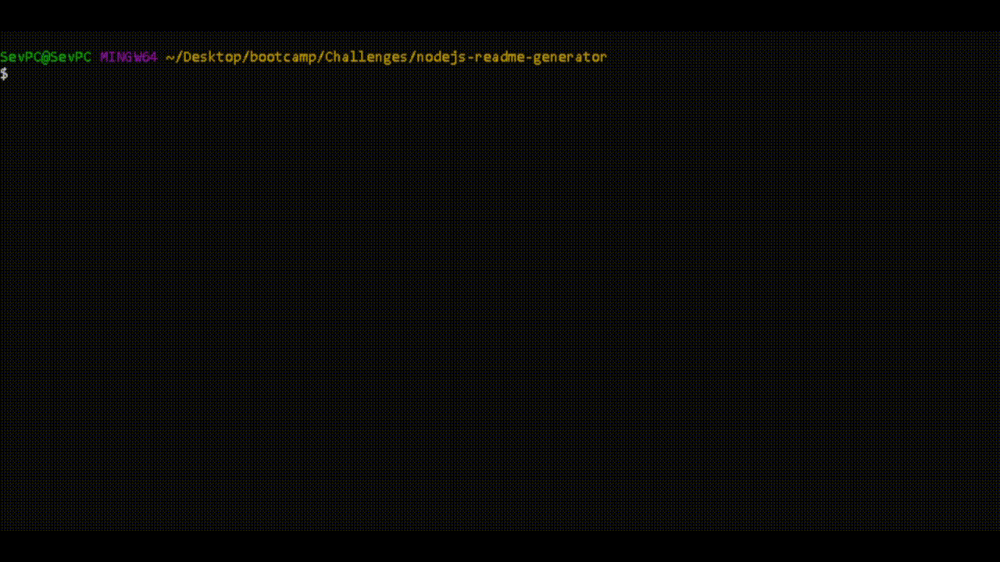

# nodejs-readme-generator

## Table of Contents

- [Description](#Description)
- [Installation](#Installation)
- [Usage](#Usage)
- [Contribution Guidelines](#Contribution_Guidelines)
- [Test Instructions](#Test_Instructions)
- [License](#License)
- [Questions?](#Questions?)

## Description

My very own simple ReadMe generator. Made using the criteria from Module 9 of my edX Web Development bootcamp. This ReadMe was generated using the ReadMe Generator!

## Installation

Simply download the full repository and all of it's contents, then run the index file (ideally inside it's own folder) with an installed instance of Node via the command "node index.js".

## Usage

From either Git Bash or a command window, from the directory that the index.js file is downloaded and located inside, install Node via command "npm i", then run the command "node index.js" to run the readme generator. The outputed ReadMe will override the ReadMe that came with this project.

## Demonstration

## Contribution Guidelines

I'm not seeking contributions at this time.

## Test Instructions

Merely run the nodejs file via the command "node index.js", then check that the project's ReadMe file was overriden with your custom ReadMe made by the generator.

## License

This project is protected under the MIT License.

## Questions?

Reach out to me either on [GitHub](https://github.com/NoahJRalph) or by [Email](mailto:NoahJRalph@gmail.com)!
